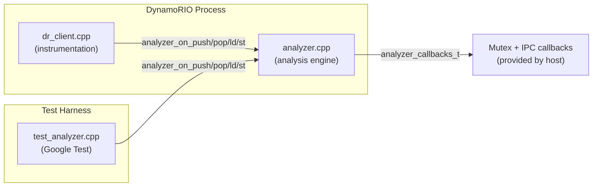

# Trace Analyzer

A [DynamoRIO](https://dynamorio.org/) instrumentation client that profiles stack memory access patterns in running programs. It classifies every stack operation as **provably private** or as participating in **inter-process/inter-thread communication (IPC)**, and records how long stack values live. The resulting profiles feed into gem5 architectural simulations for the *dual_stacks* research project.

## Project Context

The *dual_stacks* project explores **disaggregating the responsibilities of the call stack** at the microarchitectural level — separating private data from shared/IPC data to improve performance. Before proposing hardware changes, we need empirical data: *what fraction of stack operations are truly private, and what fraction involve cross-thread sharing?* The trace analyzer collects that data.

---

## Architecture

The tool is split into two layers so that the core analysis engine can be tested independently of the DynamoRIO runtime.



### Layer 1 — DynamoRIO Client ([dr_client.cpp](file:///home/bbiyikli/Desktop/dual_stacks/tools/trace_analyzer/dr_client.cpp))

The instrumentation front-end. Responsibilities:

| Concern | Detail |
|---------|--------|
| **Instruction classification** | Walks each basic block and classifies memory operands as `push`, `pop`, `ld`, or `st` based on opcode |
| **Global History Register (GHR)** | Maintained per-thread in TLS. Updated at each basic block entry: `ghr = (ghr << 22) ^ bb_pc` |
| **Context hash** | Derived from the GHR via the MurmurHash3 64-bit finalizer, masked to `CTX_HASH_BITS` (3) bits → 8 buckets |
| **Clean calls** | Inserts `dr_insert_clean_call` for each classified operation, routing to the analyzer backend |
| **Logical clock** | Counts register-writing instructions per basic block; adds ticks via `analyzer_add_logical_clock` |
| **Thread lifecycle** | Assigns monotonic 1-byte TIDs (1–254), registers stack bounds via `analyzer_register_thread` |
| **Signal handling** | Catches `SIGTERM` / `SIGINT` to dump partial results before termination |
| **FIFO timeout** | Spawns a background client thread that blocks on a named pipe; an external script writes to the pipe to trigger graceful shutdown with partial results |

### Layer 2 — Analysis Engine ([analyzer.cpp](file:///home/bbiyikli/Desktop/dual_stacks/tools/trace_analyzer/analyzer.cpp) / [analyzer.h](file:///home/bbiyikli/Desktop/dual_stacks/tools/trace_analyzer/analyzer.h))

The core analysis logic exposed through a **C API**. It is decoupled from DynamoRIO through a callback struct ([analyzer_callbacks_t](file:///home/bbiyikli/Desktop/dual_stacks/tools/trace_analyzer/analyzer.h#L21-L33)) that the host environment populates with mutex operations and an IPC-reporting hook:

```c
typedef struct {
    analyzer_mutex_create_fn  mutex_create;
    analyzer_mutex_destroy_fn mutex_destroy;
    analyzer_mutex_lock_fn    mutex_lock;
    analyzer_mutex_trylock_fn mutex_trylock;
    analyzer_mutex_unlock_fn  mutex_unlock;

    void (*add_strict_ipc)(uint8_t tid, uint32_t pushes, uint32_t pops);
    void (*log_debug)(const char *msg);
} analyzer_callbacks_t;
```

- Under DynamoRIO, the callbacks wrap `dr_mutex_*` functions.
- Under the test harness, the callbacks wrap `std::mutex`.

---

## Shadow Memory (Two-Level)

All IPC detection relies on efficient per-byte ownership tracking. The analyzer uses a two-level scheme:

### L1 — Byte-Level Shadow Directory

A two-level page table mapping every byte of the 48-bit virtual address space to a `shadow_info_t`:

```c
struct shadow_info_t {
    uint8_t owner_and_flags;  // TID (bits 0-6) + shared tag (bit 7)
    uint8_t offset;           // byte offset within the containing push
};
```

| Parameter | Value |
|-----------|-------|
| Top-level entries | 2^18 (covers 1 GB chunks) |
| Second-level pages | Allocated lazily via `mmap` with `MAP_NORESERVE` |
| Lookup cost | O(1) — two pointer dereferences |

The `offset` field is critical: when a cross-thread access is detected on byte *N* of a pushed region, the analyzer walks back `offset` bytes to find the **base address** of the containing push, then looks up the L2 entry for that base to retroactively taint all associated PCs.

### L2 — Allocation-Level Hash Table

Stores per-push metadata for retroactive IPC resolution:

```c
struct addr_detail_t {
    uintptr_t addr;
    size_t    size;
    uint8_t   owner_tid;
    uint32_t  push_count, pop_count;
    uint64_t  created_clock;
    std::vector<pc_access_t> pc_list;  // (PC, count, is_push, ctx_hash) tuples
    addr_detail_t *next;               // chained hash bucket
};
```

| Parameter | Value |
|-----------|-------|
| Hash buckets | 2^20 (1,048,576) |
| Striped locks | 4,096 (`NUM_L2_LOCKS`) |
| Hash function | Two-round multiplicative hash of `addr >> 3` |

When IPC is detected on a byte, the L2 entry for the containing push is drained: all PCs in `pc_list` are marked as IPC-tainted in the PC banks, strict IPC counts are reported via the callback, and the entry is deleted.

---

## IPC Classification

The analyzer produces four categories of stack operations, from most precise to most conservative:

| Category | Scope | How it's detected |
|----------|-------|-------------------|
| **Provably Private** | Operation | The address was only ever accessed by the owning thread |
| **Strictly IPC (Instance Level)** | Address | A different thread accessed a specific address → L1 shadow owner check, retroactive L2 drain |
| **Possibly IPC (Non-History)** | PC | If *any* instance of a PC was involved in IPC, *all* instances of that PC are counted |
| **Possibly IPC (History-Based)** | PC × context bucket | Refinement: only context-hash buckets that were actually tainted contribute, reducing false positives |

> [!NOTE]
> The relationship is always: **Strictly IPC** ≤ **History-Based** ≤ **Non-History**. Each level trades precision for coverage.

---

## PC Banks

Per-PC metadata is stored in **64 sharded `unordered_map` structures** (`NUM_PC_BANKS = 64`), each protected by its own lock. A PC is assigned to bank `(pc >> 2) % 64`.

Each PC entry contains 8 history buckets (`CTX_BUCKETS = 1 << CTX_HASH_BITS`):

```c
struct pc_global_t {
    pc_history_entry_t history[8];  // per-context-hash bucket
    bool is_push;
};

struct pc_history_entry_t {
    std::atomic<uint64_t> total_count;
    std::atomic<bool>     is_ipc;
};
```

When IPC is detected, only the specific `ctx_hash` bucket is marked `is_ipc = true`. This is what enables the history-based refinement.

---

## Lifetime Histogram

A **2049-bin histogram** (bins 0–2047 plus an overflow bin at index 2048) records the lifetime of stack values in logical clock ticks:

- **Lifetime** = `logical_clock` at pop − `logical_clock` at push (measured in register-writing instructions)
- Values with lifetime > 2047 are placed in the overflow bin
- Pushes without a matching pop are drained at exit via [analyzer_drain_hanging_pushes](file:///home/bbiyikli/Desktop/dual_stacks/tools/trace_analyzer/analyzer.h#L75)

---

## Building

### Prerequisites

| Dependency | Notes |
|------------|-------|
| DynamoRIO | Must be built at `ext/dynamorio/build` relative to the project root |
| gtest-devel | Required for unit tests (system package) |
| C++17 compiler | GCC 7+ or Clang 5+ |
| CMake | 3.10+ |

### Build Steps

From the repository root:

```bash
cd tools/trace_analyzer
mkdir -p build && cd build
cmake ..
make -j$(nproc)
```

### Build Outputs

| Artifact | Description |
|----------|-------------|
| `libanalyzer.so` | DynamoRIO client loaded via `drrun -c` |
| `libempty.so` | Minimal no-op client for measuring instrumentation overhead |
| `test_analyzer` | Google Test unit test binary |
| `test_fuzzer` | Multi-threaded concurrency stress test |

---

## Usage

### Basic Profiling

```bash
ext/dynamorio/build/bin64/drrun \
  -c tools/trace_analyzer/build/libanalyzer.so \
  -- <target_program> [args...]
```

Results are printed to **stderr** at program exit under the header `=== Stack Privacy Analysis ===`.

### With FIFO Timeout

For long-running programs, use a named pipe to trigger graceful early termination with partial results:

```bash
# Create the FIFO
mkfifo /tmp/my_fifo

# Run the profiled program
ext/dynamorio/build/bin64/drrun \
  -c tools/trace_analyzer/build/libanalyzer.so \
  -fifo_path /tmp/my_fifo \
  -- <target_program> &

# Signal termination after desired duration
echo "x" > /tmp/my_fifo
```

The client spawns a background thread that blocks on the FIFO. When data arrives, it dumps current stats and terminates.

---

## Testing

All tests are run from the `tools/trace_analyzer` directory:

```bash
./tests/run_tests.sh
```

The script rebuilds the project, then runs unit tests, the stress fuzzer, and integration tests in sequence.

### Unit Tests

Defined in [test_analyzer.cpp](file:///home/bbiyikli/Desktop/dual_stacks/tools/trace_analyzer/tests/test_analyzer.cpp). These test the analyzer engine directly via its C API — no DynamoRIO required. The test harness provides `std::mutex`-based callbacks.

| Test | What it validates |
|------|-------------------|
| `BasicPrivate` | Single-thread push/st/ld/pop → no IPC detected |
| `BasicShared` | Thread 1 pushes, thread 2 loads → IPC detected on push PC, strict IPC callback fires |
| `StoreTriggeredIPC` | Thread 1 pushes, thread 2 stores → IPC detected (same code path as load) |
| `PartialOverlapComprehensive` | 5 sub-cases: partial/offset/inner cross-thread reads within a pushed region all correctly detect sharing |
| `TemporalDepth` | Address reuse: old push/pop cycle NOT flagged, only the current active push is flagged when sharing occurs |
| `StackReuse` | Thread 1 pushes/pops then exits; thread 2 reuses the same address → should NOT be flagged as IPC |
| `GHRContext` | Same PC with different `ctx_hash` → only the tainted bucket is counted in history-based metric |
| `HistoryVsNonHistory` | Validates that history-based count ≤ non-history count when only some context buckets are tainted |
| `MultipleContextBucketTaint` | Two different context buckets tainted independently → history count reflects both |
| `Lifetimes` | Verifies lifetime histogram: 5-tick push-pop → bin[5]=1, 2500-tick → overflow bin[2048]=1 |
| `ZeroLifetime` | Push and pop at the same logical clock → lifetime = 0, bin[0] = 1 |
| `HangingPushes` | Push without matching pop → `analyzer_drain_hanging_pushes()` records the lifetime |
| `ConcurrentStress` | 2 threads × 10K iterations with cross-thread reads. Validates total counts and IPC detection |
| `MaxTIDBoundary` | Verifies that TIDs > `MAX_TID` (254) are silently ignored without crashes |
| `TryLockPcStats` | Verifies `analyzer_get_pc_stats` with `try_lock_only=true` returns partial but correct results |
| `StatsAccumulation` | Verifies total ld/st/push/pop counts are correctly accumulated |
| `L2EntryLifecycle` | Verifies L2 entry creation and draining counts |
| `PopWithoutPush` | A pop for an address never pushed should not crash and should be counted in stats |
| `RepeatedCleanup` | Multiple init/cleanup cycles don't crash or leak — only the last cycle's stats remain |

### Integration Tests

C programs executed under DynamoRIO via `drrun`. The test runner invokes each one and checks stderr output for expected IPC/privacy metrics.

| Test | Source | What it validates |
|------|--------|-------------------|
| `test_private` | [test_private.c](file:///home/bbiyikli/Desktop/dual_stacks/tools/trace_analyzer/tests/test_private.c) | 4 threads doing purely private stack work → Strictly IPC = 0 |
| `test_ipc` | [test_ipc.c](file:///home/bbiyikli/Desktop/dual_stacks/tools/trace_analyzer/tests/test_ipc.c) | 2 threads share a stack variable → Strictly IPC > 0 |
| `test_short_lifetime` | [test_short_lifetime.c](file:///home/bbiyikli/Desktop/dual_stacks/tools/trace_analyzer/tests/test_short_lifetime.c) | Inline asm push/pop → validates short lifetime histogram entries |
| `test_long_lifetime` | [test_long_lifetime.c](file:///home/bbiyikli/Desktop/dual_stacks/tools/trace_analyzer/tests/test_long_lifetime.c) | Push + 5000-iteration loop + pop → validates overflow histogram bin (>2047) has entries |
| `test_fuzzer_minimal_stress` | [test_fuzzer_minimal_stress.cpp](file:///home/bbiyikli/Desktop/dual_stacks/tools/trace_analyzer/tests/test_fuzzer_minimal_stress.cpp) | Multi-threaded stress test with stack churn + IPC anchor → validates ≥ 2 IPC PCs and correct IPC detection |

---

## Design Decisions

### Why a C API with callbacks?

The analyzer engine must run inside DynamoRIO (which provides its own threading primitives) *and* inside a plain Google Test harness (which uses `std::mutex`). A C API with a callback struct for mutex operations keeps the engine decoupled from both environments. This is the single design choice that makes the entire unit test suite possible without starting DynamoRIO.

### Why two-level shadow memory?

- **L1 (byte-level)** gives O(1) per-byte ownership lookup — the fast path for every `ld`/`st` instruction.
- **L2 (allocation-level)** stores the list of PCs associated with each push. When IPC is detected on a single byte, the `offset` field in L1 lets us find the base address and look up the L2 entry to **retroactively taint all PCs** that touched that allocation. Without L2, we would only detect IPC at the specific byte access and miss the push/pop PCs.

### Why are PC banks sharded?

Every instrumented `push` and `pop` writes to a PC bank. With 64 banks and per-bank locks, the probability of two threads contending on the same lock is low. The bank index `(pc >> 2) % 64` distributes naturally since instruction addresses differ in their low bits.

### Why does ctx_hash use a GHR?

A single PC (e.g., a library `push`) can be reached through many different call paths. The Global History Register captures the recent basic-block path, and the MurmurHash3 finalizer collapses it into a 3-bit bucket index. This enables the **history-based IPC refinement**: only the context buckets that were actually involved in cross-thread sharing are counted, reducing the false-positive rate compared to the non-history metric.

### Why `MAP_NORESERVE` for shadow pages?

Each second-level shadow page covers 1 GB of address space and is 2 GB in size (2 bytes per byte). Using `MAP_NORESERVE` means the OS only backs pages with physical memory when they are first touched. Most programs use a tiny fraction of the 48-bit address space, so the actual RSS overhead is small.

---

## File Listing

| File | Purpose |
|------|---------|
| [dr_client.cpp](file:///home/bbiyikli/Desktop/dual_stacks/tools/trace_analyzer/dr_client.cpp) | DynamoRIO instrumentation client |
| [analyzer.cpp](file:///home/bbiyikli/Desktop/dual_stacks/tools/trace_analyzer/analyzer.cpp) | Core analysis engine |
| [analyzer.h](file:///home/bbiyikli/Desktop/dual_stacks/tools/trace_analyzer/analyzer.h) | Public C API header |
| [empty_client.cpp](file:///home/bbiyikli/Desktop/dual_stacks/tools/trace_analyzer/empty_client.cpp) | Minimal baseline client for measuring instrumentation overhead |
| [CMakeLists.txt](file:///home/bbiyikli/Desktop/dual_stacks/tools/trace_analyzer/CMakeLists.txt) | Build configuration |
| [tests/test_analyzer.cpp](file:///home/bbiyikli/Desktop/dual_stacks/tools/trace_analyzer/tests/test_analyzer.cpp) | Google Test unit tests |
| [tests/test_fuzzer_minimal_stress.cpp](file:///home/bbiyikli/Desktop/dual_stacks/tools/trace_analyzer/tests/test_fuzzer_minimal_stress.cpp) | Multi-threaded integration stress test |
| [tests/test_ipc.c](file:///home/bbiyikli/Desktop/dual_stacks/tools/trace_analyzer/tests/test_ipc.c) | Integration test for IPC detection |
| [tests/test_private.c](file:///home/bbiyikli/Desktop/dual_stacks/tools/trace_analyzer/tests/test_private.c) | Integration test for private stack operations |
| [tests/test_short_lifetime.c](file:///home/bbiyikli/Desktop/dual_stacks/tools/trace_analyzer/tests/test_short_lifetime.c) | Integration test for short stack lifetimes |
| [tests/test_long_lifetime.c](file:///home/bbiyikli/Desktop/dual_stacks/tools/trace_analyzer/tests/test_long_lifetime.c) | Integration test for long stack lifetimes |
| [tests/run_tests.sh](file:///home/bbiyikli/Desktop/dual_stacks/tools/trace_analyzer/tests/run_tests.sh) | Test runner script |
